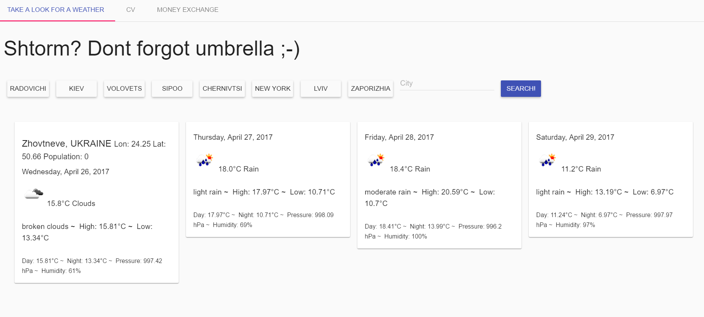

# angular-openweather-app — a weather forecast app written in AngularJS



## Installation

### Clone repository and install dependencies

via git and npm:

```
$ git clone git@github.com:Bartimeys/my-pet-project.git
$ cd [my-app-name]
$ npm install
```

### Run application via server

(see also [angular-seed docs](https://github.com/angular/angular-seed))

You can pick one of these options:

* serve this repository with a webserver of-your-choice
* install node.js and run `scripts/web-server.js`

Then navigate your browser to `http://localhost:<port>/app/index.html` to see the app running in
your browser.


